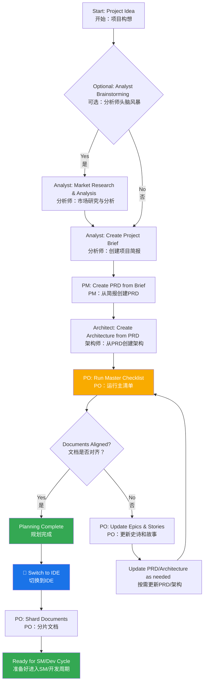
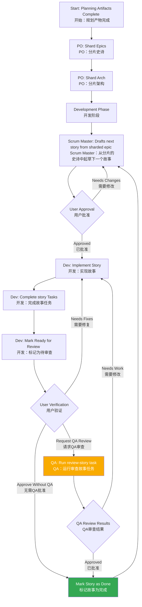

# BMad Method: Core Architecture
# BMad 方法：核心架构

## 1. Overview
## 1. 概述

The BMad Method is designed to provide agentic modes, tasks and templates to allow repeatable helpful workflows be it for agile agentic development, or expansion into vastly different domains. The core purpose of the project is to provide a structured yet flexible set of prompts, templates, and workflows that users can employ to guide AI agents (like Gemini, Claude, or ChatGPT) to perform complex tasks, guided discussions, or other meaningful domain specific flows in a predictable, high-quality manner.

BMad 方法旨在提供代理模式、任务和模板，以实现可重复的、有益的工作流，无论是用于敏捷的代理开发，还是扩展到截然不同的领域。该项目的核心目的是提供一套结构化且灵活的提示、模板和工作流，用户可以利用它们来指导 AI 代理（如 Gemini、Claude 或 ChatGPT）以可预测、高质量的方式执行复杂任务、引导式讨论或其他有意义的领域特定流程。

The systems core module facilitates a full development lifecycle tailored to the challenges of current modern AI Agentic tooling:

系统的核心模块促进了一个完整的开发生命周期，该生命周期专为应对当前现代 AI 代理工具的挑战而量身定制：

1. **Ideation & Planning**: Brainstorming, market research, and creating project briefs.
   
   **构思与规划**：头脑风暴、市场研究和创建项目简报。
2. **Architecture & Design**: Defining system architecture and UI/UX specifications.
   
   **架构与设计**：定义系统架构和 UI/UX 规范。
3. **Development Execution**: A cyclical workflow where a Scrum Master (SM) agent drafts stories with extremely specific context and a Developer (Dev) agent implements them one at a time. This process works for both new (Greenfield) and existing (Brownfield) projects.
   
   **开发执行**：一个循环工作流，其中 Scrum Master (SM) 代理起草具有极其特定上下文的故事，而开发人员 (Dev) 代理一次实现一个。此过程适用于新项目（绿地）和现有项目（棕地）。

## 2. System Architecture Diagram
## 2. 系统架构图

The entire BMad-Method ecosystem is designed around the installed `bmad-core` directory, which acts as the brain of the operation. The `tools` directory provides the means to process and package this brain for different environments.

整个 BMad-Method 生态系统都围绕已安装的 `bmad-core` 目录设计，该目录充当操作的大脑。`tools` 目录提供了为不同环境处理和打包此大脑的方法。

```mermaid
graph TD
    subgraph BMad Method Project <br> BMad 方法项目
        subgraph Core Framework <br> 核心框架
            A["bmad-core"]
            A --> B["agents <br> 代理"]
            A --> C["agent-teams <br> 代理团队"]
            A --> D["workflows <br> 工作流"]
            A --> E["templates <br> 模板"]
            A --> F["tasks <br> 任务"]
            A --> G["checklists <br> 清单"]
            A --> H["data (KB) <br> 数据 (知识库)"]
        end

        subgraph Tooling <br> 工具
            I["tools/builders/web-builder.js"]
        end

        subgraph Outputs <br> 输出
            J["dist"]
        end

        B -- defines dependencies for <br> 定义依赖 --> E
        B -- defines dependencies for <br> 定义依赖 --> F
        B -- defines dependencies for <br> 定义依赖 --> G
        B -- defines dependencies for <br> 定义依赖 --> H

        C -- bundles <br> 捆绑 --> B
        I -- reads from <br> 读取 --> A
        I -- creates <br> 创建 --> J
    end

    subgraph Target Environments <br> 目标环境
        K["IDE (Cursor, VS Code, etc.)"]
        L["Web UI (Gemini, ChatGPT)"]
    end

    B --> K
    J --> L

    style A fill:#1a73e8,color:#fff
    style I fill:#f9ab00,color:#fff
    style J fill:#34a853,color:#fff
```

## 3. Core Components
## 3. 核心组件

The `bmad-core` directory contains all the definitions and resources that give the agents their capabilities.

`bmad-core` 目录包含赋予代理能力的所有定义和资源。

### 3.1. Agents (`bmad-core/agents/`)
### 3.1. 代理 (`bmad-core/agents/`)

- **Purpose**: These are the foundational building blocks of the system. Each markdown file (e.g., `bmad-master.md`, `pm.md`, `dev.md`) defines the persona, capabilities, and dependencies of a single AI agent.

  **目的**：这些是系统的基础构建块。每个 markdown 文件（例如 `bmad-master.md`、`pm.md`、`dev.md`）都定义了单个 AI 代理的角色、能力和依赖关系。
- **Structure**: An agent file contains a YAML header that specifies its role, persona, dependencies, and startup instructions. These dependencies are lists of tasks, templates, checklists, and data files that the agent is allowed to use.

  **结构**：代理文件包含一个 YAML 标头，用于指定其角色、个性、依赖项和启动说明。这些依赖项是代理允许使用的任务、模板、清单和数据文件的列表。
- **Startup Instructions**: Agents can include startup sequences that load project-specific documentation from the `docs/` folder, such as coding standards, API specifications, or project structure documents. This provides immediate project context upon activation.

  **启动说明**：代理可以包含从 `docs/` 文件夹加载项目特定文档的启动序列，例如编码标准、API 规范或项目结构文档。这在激活时提供了即时的项目上下文。
- **Document Integration**: Agents can reference and load documents from the project's `docs/` folder as part of tasks, workflows, or startup sequences. Users can also drag documents directly into chat interfaces to provide additional context.

  **文档集成**：代理可以作为任务、工作流或启动序列的一部分，引用和加载项目 `docs/` 文件夹中的文档。用户还可以将文档直接拖到聊天界面中以提供额外的上下文。
- **Example**: The `bmad-master` agent lists its dependencies, which tells the build tool which files to include in a web bundle and informs the agent of its own capabilities.

  **示例**：`bmad-master` 代理列出了其依赖项，这告诉构建工具要将哪些文件包含在 Web 包中，并告知代理其自身的能力。

### 3.2. Agent Teams (`bmad-core/agent-teams/`)
### 3.2. 代理团队 (`bmad-core/agent-teams/`)

- **Purpose**: Team files (e.g., `team-all.yaml`) define collections of agents and workflows that are bundled together for a specific purpose, like "full-stack development" or "backend-only". This creates a larger, pre-packaged context for web UI environments.

  **目的**：团队文件（例如 `team-all.yaml`）定义了为特定目的（如“全栈开发”或“仅后端”）捆绑在一起的代理和工作流的集合。这为 Web UI 环境创建了一个更大的、预打包的上下文。
- **Structure**: A team file lists the agents to include. It can use wildcards, such as `"*"` to include all agents. This allows for the creation of comprehensive bundles like `team-all`.

  **结构**：团队文件列出了要包含的代理。它可以使用通配符，例如 `"*"` 来包含所有代理。这允许创建像 `team-all` 这样的综合包。

### 3.3. Workflows (`bmad-core/workflows/`)
### 3.3. 工作流 (`bmad-core/workflows/`)

- **Purpose**: Workflows are YAML files (e.g., `greenfield-fullstack.yaml`) that define a prescribed sequence of steps and agent interactions for a specific project type. They act as a strategic guide for the user and the `bmad-orchestrator` agent.

  **目的**：工作流是 YAML 文件（例如 `greenfield-fullstack.yaml`），它们为特定项目类型定义了规定的步骤序列和代理交互。它们充当用户和 `bmad-orchestrator` 代理的战略指南。
- **Structure**: A workflow defines sequences for both complex and simple projects, lists the agents involved at each step, the artifacts they create, and the conditions for moving from one step to the next. It often includes a Mermaid diagram for visualization.

  **结构**：工作流为复杂和简单的项目定义了序列，列出了每个步骤涉及的代理、它们创建的产物以及从一个步骤移动到下一个步骤的条件。它通常包含一个用于可视化的 Mermaid 图。

### 3.4. Reusable Resources (`templates`, `tasks`, `checklists`, `data`)
### 3.4. 可重用资源 (`templates`, `tasks`, `checklists`, `data`)

- **Purpose**: These folders house the modular components that are dynamically loaded by agents based on their dependencies.

  **目的**：这些文件夹存放了由代理根据其依赖关系动态加载的模块化组件。

  **`templates/`**: Contains markdown templates for common documents like PRDs, architecture specifications, and user stories.

  **`templates/`**：包含 PRD、架构规范和用户故事等常见文档的 markdown 模板。
  - **`tasks/`**: Defines the instructions for carrying out specific, repeatable actions like "shard-doc" or "create-next-story".

    **`tasks/`**：定义了执行特定、可重复操作（如“shard-doc”或“create-next-story”）的指令。
  - **`checklists/`**: Provides quality assurance checklists for agents like the Product Owner (`po`) or Architect.

    **`checklists/`**：为产品负责人（`po`）或架构师等代理提供质量保证清单。
  - **`data/`**: Contains the core knowledge base (`bmad-kb.md`), technical preferences (`technical-preferences.md`), and other key data files.

    **`data/`**：包含核心知识库（`bmad-kb.md`）、技术偏好（`technical-preferences.md`）和其他关键数据文件。

#### 3.4.1. Template Processing System
#### 3.4.1. 模板处理系统

A key architectural principle of BMad is that templates are self-contained and interactive - they embed both the desired document output and the LLM instructions needed to work with users. This means that in many cases, no separate task is needed for document creation, as the template itself contains all the processing logic.

BMad 的一个关键架构原则是模板是自包含和交互式的——它们嵌入了所需的文档输出和与用户协作所需的 LLM 指令。这意味着在许多情况下，不需要单独的任务来创建文档，因为模板本身包含了所有的处理逻辑。

The BMad framework employs a sophisticated template processing system orchestrated by three key components:

BMad 框架采用了一个由三个关键组件精心编排的复杂模板处理系统：

- **`template-format.md`** (`bmad-core/utils/`): Defines the foundational markup language used throughout all BMad templates. This specification establishes syntax rules for variable substitution (`{{placeholders}}`), AI-only processing directives (`[[LLM: instructions]]`), and conditional logic blocks. Templates follow this format to ensure consistent processing across the system.

  **`template-format.md`** (`bmad-core/utils/`)：定义了所有 BMad 模板中使用的基础标记语言。该规范确立了变量替换（`{{placeholders}}`）、仅 AI 处理指令（`[[LLM: instructions]]`）和条件逻辑块的语法规则。模板遵循此格式以确保在整个系统中进行一致的处理。

- **`create-doc.md`** (`bmad-core/tasks/`): Acts as the orchestration engine that manages the entire document generation workflow. This task coordinates template selection, manages user interaction modes (incremental vs. rapid generation), enforces template-format processing rules, and handles validation. It serves as the primary interface between users and the template system.

  **`create-doc.md`** (`bmad-core/tasks/`)：充当管理整个文档生成工作流的编排引擎。此任务协调模板选择，管理用户交互模式（增量与快速生成），强制执行模板格式处理规则，并处理验证。它作为用户和模板系统之间的主要接口。

- **`advanced-elicitation.md`** (`bmad-core/tasks/`): Provides an interactive refinement layer that can be embedded within templates through `[[LLM: instructions]]` blocks. This component offers 10 structured brainstorming actions, section-by-section review capabilities, and iterative improvement workflows to enhance content quality.

  **`advanced-elicitation.md`** (`bmad-core/tasks/`)：提供一个交互式优化层，可以通过 `[[LLM: instructions]]` 块嵌入到模板中。该组件提供 10 个结构化的头脑风暴操作、逐节审查功能和迭代改进工作流，以提高内容质量。

The system maintains a clean separation of concerns: template markup is processed internally by AI agents but never exposed to users, while providing sophisticated AI processing capabilities through embedded intelligence within the templates themselves.

该系统保持了清晰的关注点分离：模板标记由 AI 代理在内部处理，但从不向用户公开，同时通过模板本身内嵌的智能提供复杂的 AI 处理能力。

#### 3.4.2. Technical Preferences System
#### 3.4.2. 技术偏好系统

BMad includes a personalization layer through the `technical-preferences.md` file in `bmad-core/data/`. This file serves as a persistent technical profile that influences agent behavior across all projects.

BMad 通过 `bmad-core/data/` 中的 `technical-preferences.md` 文件提供了一个个性化层。该文件作为一个持久的技术配置文件，影响着所有项目中代理的行为。

**Purpose and Benefits:**
**目的和好处：**

- **Consistency**: Ensures all agents reference the same technical preferences

  **一致性**：确保所有代理引用相同的技术偏好
- **Efficiency**: Eliminates the need to repeatedly specify preferred technologies

  **效率**：无需重复指定首选技术
- **Personalization**: Agents provide recommendations aligned with user preferences

  **个性化**：代理提供与用户偏好一致的建议
- **Learning**: Captures lessons learned and preferences that evolve over time

  **学习**：捕获经验教训和随时间演变的偏好

**Content Structure:**
The file typically includes preferred technology stacks, design patterns, external services, coding standards, and anti-patterns to avoid. Agents automatically reference this file during planning and development to provide contextually appropriate suggestions.

该文件通常包括首选的技术栈、设计模式、外部服务、编码标准以及要避免的反模式。代理在规划和开发过程中会自动引用此文件，以提供与上下文相符的建议。

**Integration Points:**
**集成点：**

- Templates can reference technical preferences during document generation

  模板可以在文档生成期间引用技术偏好
- Agents suggest preferred technologies when appropriate for project requirements

  当适合项目需求时，代理会建议首选技术
- When preferences don't fit project needs, agents explain alternatives

  当偏好不符合项目需求时，代理会解释替代方案
- Web bundles can include preferences content for consistent behavior across platforms

  Web 包可以包含偏好内容，以在不同平台上实现一致的行为

**Evolution Over Time:**
Users are encouraged to continuously update this file with discoveries from projects, adding both positive preferences and technologies to avoid, creating a personalized knowledge base that improves agent recommendations over time.

鼓励用户不断用项目中的发现更新此文件，添加正面偏好和要避免的技术，从而创建一个个性化的知识库，随着时间的推移改进代理的建议。

## 4. The Build & Delivery Process
## 4. 构建与交付流程

The framework is designed for two primary environments: local IDEs and web-based AI chat interfaces. The `web-builder.js` script is the key to supporting the latter.

该框架专为两个主要环境设计：本地 IDE 和基于 Web 的 AI 聊天界面。`web-builder.js` 脚本是支持后者的关键。

### 4.1. Web Builder (`tools/builders/web-builder.js`)
### 4.1. Web 构建器 (`tools/builders/web-builder.js`)

- **Purpose**: This Node.js script is responsible for creating the `.txt` bundles found in `dist`.

  **目的**：这个 Node.js 脚本负责创建在 `dist` 中找到的 `.txt` 包。
- **Process**:

  **流程**：
  1. **Resolves Dependencies**: For a given agent or team, the script reads its definition file.
   
     **解决依赖关系**：对于给定的代理或团队，脚本会读取其定义文件。
  2. It recursively finds all dependent resources (tasks, templates, etc.) that the agent/team needs.
   
     它递归地查找代理/团队需要的所有依赖资源（任务、模板等）。
  3. **Bundles Content**: It reads the content of all these files and concatenates them into a single, large text file, with clear separators indicating the original file path of each section.
   
     **捆绑内容**：它读取所有这些文件的内容，并将它们连接成一个大的文本文件，并用清晰的分隔符指示每个部分的原始文件路径。
  4. **Outputs Bundle**: The final `.txt` file is saved in the `dist` directory, ready to be uploaded to a web UI.
   
     **输出包**：最终的 `.txt` 文件保存在 `dist` 目录中，准备上传到 Web UI。

### 4.2. Environment-Specific Usage
### 4.2. 特定环境的用法

- **For IDEs**: Users interact with the agents directly via their markdown files in `bmad-core/agents/`. The IDE integration (for Cursor, Claude Code, etc.) knows how to call these agents.

  **对于 IDE**：用户通过 `bmad-core/agents/` 中的 markdown 文件直接与代理交互。IDE 集成（对于 Cursor、Claude Code 等）知道如何调用这些代理。
- **For Web UIs**: Users upload a pre-built bundle from `dist`. This single file provides the AI with the context of the entire team and all their required tools and knowledge.

  **对于 Web UI**：用户从 `dist` 上传一个预构建的包。这个单一文件为 AI 提供了整个团队及其所需的所有工具和知识的上下文。

## 5. BMad Workflows
## 5. BMad 工作流

### 5.1. The Planning Workflow
### 5.1. 规划工作流

Before development begins, BMad follows a structured planning workflow that establishes the foundation for successful project execution:

在开发开始之前，BMad 遵循一个结构化的规划工作流，为成功的项目执行奠定基础：



**Key Planning Phases:**

**关键规划阶段：**

1. **Optional Analysis**: Analyst conducts market research and competitive analysis
   
   **可选分析**：分析师进行市场研究和竞争分析
2. **Project Brief**: Foundation document created by Analyst or user
   
   **项目简报**：由分析师或用户创建的基础文档
3. **PRD Creation**: PM transforms brief into comprehensive product requirements
   
   **PRD 创建**：项目经理将简报转化为全面的产品需求
4. **Architecture Design**: Architect creates technical foundation based on PRD
   
   **架构设计**：架构师根据 PRD 创建技术基础
5. **Validation & Alignment**: PO ensures all documents are consistent and complete
   
   **验证与对齐**：产品负责人确保所有文档一致且完整
6. **Refinement**: Updates to epics, stories, and documents as needed
   
   **优化**：根据需要更新史诗、故事和文档
7. **Environment Transition**: Critical switch from web UI to IDE for development workflow
   
   **环境转换**：从 Web UI 切换到 IDE 以进行开发工作流的关键步骤
8. **Document Preparation**: PO shards large documents for development consumption
   
   **文档准备**：产品负责人为开发消费分片大型文档

**Workflow Orchestration**: The `bmad-orchestrator` agent uses these workflow definitions to guide users through the complete process, ensuring proper transitions between planning (web UI) and development (IDE) phases.

**工作流编排**：`bmad-orchestrator` 代理使用这些工作流定义来指导用户完成整个过程，确保在规划（Web UI）和开发（IDE）阶段之间进行适当的转换。

### 5.2. The Core Development Cycle
### 5.2. 核心开发周期

Once the initial planning and architecture phases are complete, the project moves into a cyclical development workflow, as detailed in the `bmad-kb.md`. This ensures a steady, sequential, and quality-controlled implementation process.

一旦初始规划和架构阶段完成，项目就进入一个循环的开发工作流，详见 `bmad-kb.md`。这确保了一个稳定、顺序和质量受控的实施过程。



This cycle continues, with the Scrum Master, Developer, and optionally QA agents working together. The QA agent provides senior developer review capabilities through the `review-story` task, offering code refactoring, quality improvements, and knowledge transfer. This ensures high code quality while maintaining development velocity.

这个周期持续进行，Scrum Master、开发人员以及可选的 QA 代理协同工作。QA 代理通过 `review-story` 任务提供高级开发人员审查能力，提供代码重构、质量改进和知识转移。这在保持开发速度的同时确保了高代码质量。
