# BMad Method — User Guide
# BMad 方法 — 用户指南

This guide will help you understand and effectively use the BMad Method for agile AI-driven planning and development.

本指南将帮助您理解并有效使用 BMad 方法，以进行敏捷的 AI 驱动规划和开发。

## The BMad Plan and Execute Workflow
## BMad 规划与执行工作流

First, here is the full standard Greenfield Planning + Execution Workflow. Brownfield is very similar, but it's suggested to understand this greenfield first, even if on a simple project before tackling a brownfield project. The BMad Method needs to be installed to the root of your new project folder. For the planning phase, you can optionally perform it with powerful web agents, potentially resulting in higher quality results at a fraction of the cost it would take to complete if providing your own API key or credits in some Agentic tools. For planning, powerful thinking models and larger context - along with working as a partner with the agents will net the best results.

首先，这里是完整的标准绿地规划 + 执行工作流。棕地项目非常相似，但建议先理解这个绿地工作流，即使只是在一个简单的项目上，然后再处理棕地项目。BMad 方法需要安装到您新项目文件夹的根目录。在规划阶段，您可以选择使用强大的网络代理来执行，这可能会以更低的成本获得更高质量的结果，而无需在某些代理工具中提供您自己的 API 密钥或积分。对于规划，强大的思维模型和更广阔的背景——以及与代理作为合作伙伴——将获得最佳结果。

If you are going to use the BMad Method with a Brownfield project (an existing project), review **[Working in the Brownfield](./working-in-the-brownfield.md)**.

如果您打算在棕地项目（现有项目）中使用 BMad 方法，请查阅 **[在棕地项目中工作](./working-in-the-brownfield-en-cn.md)**。

If the diagrams below don't render, install Markdown All in One along with the Markdown Preview Mermaid Support plugins to VSCode (or one of the forked clones). With these plugins, if you right click on the tab when open, there should be an Open Preview option, or check the IDE documentation.

如果下图无法渲染，请在 VSCode（或其派生克隆版本）中安装 Markdown All in One 以及 Markdown Preview Mermaid Support 插件。安装这些插件后，右键单击打开的标签页，应该会有一个“打开预览”选项，或者查看您 IDE 的文档。

### The Planning Workflow (Web UI or Powerful IDE Agents)
### 规划工作流（Web UI 或强大的 IDE 代理）

Before development begins, BMad follows a structured planning workflow that's ideally done in web UI for cost efficiency:

在开发开始之前，BMad 遵循一个结构化的规划工作流，为了成本效益，最好在 Web UI 中完成：

```mermaid
graph TD
    A["Start: Project Idea <br> 开始：项目构想"] --> B{"Optional: Analyst Research <br> 可选：分析师研究"}
    B -->|Yes / 是| C["Analyst: Brainstorming (Optional) <br> 分析师：头脑风暴（可选）"]
    B -->|No / 否| G{"Project Brief Available? <br> 项目简报是否可用？"}
    C --> C2["Analyst: Market Research (Optional) <br> 分析师：市场研究（可选）"]
    C2 --> C3["Analyst: Competitor Analysis (Optional) <br> 分析师：竞争对手分析（可选）"]
    C3 --> D["Analyst: Create Project Brief <br> 分析师：创建项目简报"]
    D --> G
    G -->|Yes / 是| E["PM: Create PRD from Brief (Fast Track) <br> PM：从简报创建PRD（快速通道）"]
    G -->|No / 否| E2["PM: Interactive PRD Creation (More Questions) <br> PM：交互式PRD创建（更多问题）"]
    E --> F["PRD Created with FRs, NFRs, Epics & Stories <br> PRD已创建，包含功能需求、非功能需求、史诗和故事"]
    E2 --> F
    F --> F2{"UX Required? <br> 需要用户体验设计吗？"}
    F2 -->|Yes / 是| F3["UX Expert: Create Front End Spec <br> UX专家：创建前端规范"]
    F2 -->|No / 否| H["Architect: Create Architecture from PRD <br> 架构师：从PRD创建架构"]
    F3 --> F4["UX Expert: Generate UI Prompt for Lovable/V0 (Optional) <br> UX专家：为Lovable/V0版本生成UI提示（可选）"]
    F4 --> H2["Architect: Create Architecture from PRD + UX Spec <br> 架构师：从PRD和UX规范创建架构"]
    H --> Q{"Early Test Strategy? (Optional) <br> 早期测试策略？（可选）"}
    H2 --> Q
    Q -->|Yes / 是| R["QA: Early Test Architecture Input on High-Risk Areas <br> QA：对高风险领域提供早期测试架构输入"]
    Q -->|No / 否| I
    R --> I["PO: Run Master Checklist <br> PO：运行主清单"]
    I --> J{"Documents Aligned? <br> 文档是否对齐？"}
    J -->|Yes / 是| K["Planning Complete <br> 规划完成"]
    J -->|No / 否| L["PO: Update Epics & Stories <br> PO：更新史诗和故事"]
    L --> M["Update PRD/Architecture as needed <br> 按需更新PRD/架构"]
    M --> I
    K --> N["📁 Switch to IDE (If in a Web Agent Platform) <br> 切换到IDE（如果在Web代理平台中）"]
    N --> O["PO: Shard Documents <br> PO：分片文档"]
    O --> P["Ready for SM/Dev Cycle <br> 准备好进入SM/Dev周期"]

    style A fill:#f5f5f5,color:#000
    style B fill:#e3f2fd,color:#000
    style C fill:#e8f5e9,color:#000
    style C2 fill:#e8f5e9,color:#000
    style C3 fill:#e8f5e9,color:#000
    style D fill:#e8f5e9,color:#000
    style E fill:#fff3e0,color:#000
    style E2 fill:#fff3e0,color:#000
    style F fill:#fff3e0,color:#000
    style F2 fill:#e3f2fd,color:#000
    style F3 fill:#e1f5fe,color:#000
    style F4 fill:#e1f5fe,color:#000
    style G fill:#e3f2fd,color:#000
    style H fill:#f3e5f5,color:#000
    style H2 fill:#f3e5f5,color:#000
    style Q fill:#e3f2fd,color:#000
    style R fill:#ffd54f,color:#000
    style I fill:#f9ab00,color:#fff
    style J fill:#e3f2fd,color:#000
    style K fill:#34a853,color:#fff
    style L fill:#f9ab00,color:#fff
    style M fill:#fff3e0,color:#000
    style N fill:#1a73e8,color:#fff
    style O fill:#f9ab00,color:#fff
    style P fill:#34a853,color:#fff
```



#### Web UI to IDE Transition
#### 从 Web UI 到 IDE 的过渡

**Critical Transition Point**: Once the PO confirms document alignment, you must switch from web UI to IDE to begin the development workflow:
**关键过渡点**：一旦产品负责人（PO）确认文档对齐，您必须从 Web UI 切换到 IDE 以开始开发工作流：

1. **Copy Documents to Project**: Ensure `docs/prd.md` and `docs/architecture.md` are in your project's docs folder (or a custom location you can specify during installation)

   **复制文档到项目**：确保 `docs/prd.md` 和 `docs/architecture.md` 文件位于您项目的 docs 文件夹中（或您在安装时指定的自定义位置）。
2. **Switch to IDE**: Open your project in your preferred Agentic IDE
   
   **切换到 IDE**：在您偏好的代理式 IDE 中打开您的项目。
3. **Document Sharding**: Use the PO agent to shard the PRD and then the Architecture
   
   **文档分片**：使用 PO 代理对 PRD 和架构文档进行分片。
4. **Begin Development**: Start the Core Development Cycle that follows

   **开始开发**：开始接下来的核心开发周期。

#### Planning Artifacts (Standard Paths)
#### 规划产物（标准路径）

```text
PRD              → docs/prd.md
Architecture     → docs/architecture.md
Sharded Epics    → docs/epics/
Sharded Stories  → docs/stories/
QA Assessments   → docs/qa/assessments/
QA Gates         → docs/qa/gates/
```

### The Core Development Cycle (IDE)
### 核心开发周期 (IDE)

Once planning is complete and documents are sharded, BMad follows a structured development workflow:

一旦规划完成且文档已分片，BMad 将遵循一个结构化的开发工作流：

```mermaid
graph TD
    A["Development Phase Start <br> 开发阶段开始"] --> B["SM: Reviews Previous Story Dev/QA Notes <br> SM：审查之前的故事开发/QA记录"]
    B --> B2["SM: Drafts Next Story from Sharded Epic + Architecture <br> SM：从分片史诗和架构草拟下一个故事"]
    B2 --> S{"High-Risk Story? (Optional) <br> 高风险故事？（可选）"}
    S -->|Yes / 是| T["QA: *risk + *design on Draft Story <br> QA：对草稿故事进行*风险+*设计"]
    S -->|No / 否| B3
    T --> U["Test Strategy & Risk Profile Created <br> 测试策略和风险画像已创建"]
    U --> B3{"PO: Validate Story Draft (Optional) <br> PO：验证故事草稿（可选）"}
    B3 -->|Validation Requested <br> 请求验证| B4["PO: Validate Story Against Artifacts <br> PO：根据产物验证故事"]
    B3 -->|Skip Validation <br> 跳过验证| C{"User Approval <br> 用户批准"}
    B4 --> C
    C -->|Approved <br> 已批准| D["Dev: Sequential Task Execution <br> 开发：顺序执行任务"]
    C -->|Needs Changes <br> 需要修改| B2
    D --> E["Dev: Implement Tasks + Tests <br> 开发：实现任务+测试"]
    E --> V{"Mid-Dev QA Check? (Optional) <br> 开发中期QA检查？（可选）"}
    V -->|Yes / 是| W["QA: *trace or *nfr for Early Validation <br> QA：*追踪或*非功能需求进行早期验证"]
    V -->|No / 否| F
    W --> X["Dev: Address Coverage/NFR Gaps <br> 开发：解决覆盖率/非功能需求差距"]
    X --> F["Dev: Run All Validations <br> 开发：运行所有验证"]
    F --> G["Dev: Mark Ready for Review + Add Notes <br> 开发：标记为待审查+添加备注"]
    G --> H{"User Verification <br> 用户验证"}
    H -->|Request QA Review <br> 请求QA审查| I["QA: Test Architect Review + Quality Gate <br> QA：测试架构师审查+质量门"]
    H -->|Approve Without QA <br> 无需QA批准| M["IMPORTANT: Verify All Regression Tests and Linting are Passing <br> 重要：验证所有回归测试和代码检查通过"]
    I --> J["QA: Test Architecture Analysis + Active Refactoring <br> QA：测试架构分析+主动重构"]
    J --> L{"QA Decision <br> QA决策"}
    L -->|Needs Dev Work <br> 需要开发工作| D
    L -->|Approved <br> 已批准| M
    H -->|Needs Fixes <br> 需要修复| D
    M --> N["IMPORTANT: COMMIT YOUR CHANGES BEFORE PROCEEDING! <br> 重要：继续前请提交您的更改！"]
    N --> Y{"Gate Update Needed? <br> 需要更新质量门吗？"}
    Y -->|Yes / 是| Z["QA: *gate to Update Status <br> QA：*gate更新状态"]
    Y -->|No / 否| K
    Z --> K["Mark Story as Done <br> 标记故事为完成"]
    K --> B

    style A fill:#f5f5f5,color:#000
    style B fill:#e8f5e9,color:#000
    style B2 fill:#e8f5e9,color:#000
    style S fill:#e3f2fd,color:#000
    style T fill:#ffd54f,color:#000
    style U fill:#ffd54f,color:#000
    style B3 fill:#e3f2fd,color:#000
    style B4 fill:#fce4ec,color:#000
    style C fill:#e3f2fd,color:#000
    style D fill:#e3f2fd,color:#000
    style E fill:#e3f2fd,color:#000
    style V fill:#e3f2fd,color:#000
    style W fill:#ffd54f,color:#000
    style X fill:#e3f2fd,color:#000
    style F fill:#e3f2fd,color:#000
    style G fill:#e3f2fd,color:#000
    style H fill:#e3f2fd,color:#000
    style I fill:#f9ab00,color:#fff
    style J fill:#ffd54f,color:#000
    style K fill:#34a853,color:#fff
    style L fill:#e3f2fd,color:#000
    style M fill:#ff5722,color:#fff
    style N fill:#d32f2f,color:#fff
    style Y fill:#e3f2fd,color:#000
    style Z fill:#ffd54f,color:#000
```



## Prerequisites
## 先决条件

Before installing BMad Method, ensure you have:
在安装 BMad 方法之前，请确保您已具备：

- **Node.js** ≥ 18, **npm** ≥ 9
- **Git** installed and configured
  **Git** 已安装并配置
- **(Optional)** VS Code with "Markdown All in One" + "Markdown Preview Mermaid Support" extensions
  **(可选)** VS Code 及 "Markdown All in One" + "Markdown Preview Mermaid Support" 插件

## Installation
## 安装

### Optional
### 可选

If you want to do the planning on the web with Claude (Sonnet 4 or Opus), Gemini Gem (2.5 Pro), or Custom GPTs:
如果您想在网页上使用 Claude (Sonnet 4 或 Opus)、Gemini Gem (2.5 Pro) 或自定义 GPTs 进行规划：

1. Navigate to `dist/teams/`
   导航到 `dist/teams/`
2. Copy `team-fullstack.txt`
   复制 `team-fullstack.txt`
3. Create new Gemini Gem or CustomGPT
   创建新的 Gemini Gem 或 CustomGPT
4. Upload file with instructions: "Your critical operating instructions are attached, do not break character as directed"
   上传文件并附上说明：“您的关键操作指令已附上，请按指示执行，不要偏离角色”
5. Type `/help` to see available commands
   输入 `/help` 查看可用命令

### IDE Project Setup
### IDE 项目设置

```bash
# Interactive installation (recommended)
# 交互式安装（推荐）
npx bmad-method install
```

## Special Agents
## 特殊代理

There are two BMad agents — in the future they'll be consolidated into a single BMad-Master.

目前有两个 BMad 代理——未来它们将被整合为单一的 BMad-Master。

### BMad-Master

This agent can do any task or command that all other agents can do, aside from actual story implementation. Additionally, this agent can help explain the BMad Method when on the web by accessing the knowledge base and explaining anything to you about the process.

该代理可以执行所有其他代理能做的任何任务或命令，除了实际的故事实现。此外，该代理在网页上时，可以通过访问知识库来帮助解释 BMad 方法，并向您解释有关流程的任何内容。

If you don't want to bother switching between different agents aside from the dev, this is the agent for you. Just remember that as the context grows, the performance of the agent degrades, therefore it is important to instruct the agent to compact the conversation and start a new conversation with the compacted conversation as the initial message. Do this often, preferably after each story is implemented.

如果您不想在除了开发代理之外的不同代理之间切换，那么这个代理适合您。但请记住，随着上下文的增长，代理的性能会下降，因此，指示代理压缩对话并以压缩后的对话作为初始消息开始新的对话非常重要。请经常这样做，最好在每个故事实现后都这样做。

### BMad-Orchestrator

This agent should NOT be used within the IDE, it is a heavyweight, special-purpose agent that utilizes a lot of context and can morph into any other agent. This exists solely to facilitate the teams within the web bundles. If you use a web bundle you will be greeted by the BMad Orchestrator.

此代理不应在 IDE 中使用，它是一个重量级的专用代理，利用大量上下文并可以变形为任何其他代理。它的存在完全是为了促进 Web 包中的团队协作。如果您使用 Web 包，您将会遇到 BMad Orchestrator。

### How Agents Work
### 代理如何工作

#### Dependencies System
#### 依赖系统

Each agent has a YAML section that defines its dependencies:

每个代理都有一个 YAML 部分来定义其依赖项：

```yaml
dependencies:
  templates:
    - prd-template.md
    - user-story-template.md
  tasks:
    - create-doc.md
    - shard-doc.md
  data:
    - bmad-kb.md
```

**Key Points:**
**关键点：**

- Agents only load resources they need (lean context)
  代理只加载它们需要的资源（精简上下文）
- Dependencies are automatically resolved during bundling
  依赖项在打包过程中自动解析
- Resources are shared across agents to maintain consistency
  资源在代理之间共享以保持一致性

#### Agent Interaction
#### 代理交互

**In IDE:**
**在 IDE 中：**

```bash
# Some IDEs, like Cursor or Windsurf for example, utilize manual rules so interaction is done with the '@' symbol
# 某些 IDE，例如 Cursor 或 Windsurf，使用手动规则，因此交互是通过 '@' 符号完成的
@pm Create a PRD for a task management app
@architect Design the system architecture
@dev Implement the user authentication

# Some IDEs, like Claude Code, use slash commands instead
# 某些 IDE，例如 Claude Code，则使用斜杠命令
/pm Create user stories
/dev Fix the login bug
```

#### Interactive Modes
#### 交互模式

- **Incremental Mode**: Step-by-step with user input
  
  **增量模式**：通过用户输入逐步进行
- **YOLO Mode**: Rapid generation with minimal interaction
  
  **YOLO 模式**：以最少的交互快速生成

## IDE Integration
## IDE 集成

### IDE Best Practices
### IDE 最佳实践

- **Context Management**: Keep relevant files only in context, keep files as lean and focused as necessary
  
  **上下文管理**：仅将相关文件保留在上下文中，保持文件尽可能精简和专注
- **Agent Selection**: Use appropriate agent for task
  
  **代理选择**：为任务选择合适的代理
- **Iterative Development**: Work in small, focused tasks
  
  **迭代开发**：以小而专注的任务进行工作
- **File Organization**: Maintain clean project structure
  
  **文件组织**：保持清晰的项目结构
- **Commit Regularly**: Save your work frequently
  
  **定期提交**：频繁保存您的工作

## The Test Architect (QA Agent)
## 测试架构师（QA 代理）

### Overview
### 概述

The QA agent in BMad is not just a "senior developer reviewer" - it's a **Test Architect** with deep expertise in test strategy, quality gates, and risk-based testing. Named Quinn, this agent provides advisory authority on quality matters while actively improving code when safe to do so.

BMad 中的 QA 代理不仅仅是一个“高级开发评审员”——它是一位在测试策略、质量门和基于风险的测试方面拥有深厚专业知识的**测试架构师**。这位名为 Quinn 的代理在质量问题上提供咨询权威，并在安全的情况下积极改进代码。

#### Quick Start (Essential Commands)
#### 快速入门（基本命令）

```bash
@qa *risk {story}       # Assess risks before development
                         # 开发前评估风险
@qa *design {story}     # Create test strategy
                         # 创建测试策略
@qa *trace {story}      # Verify test coverage during dev
                         # 开发期间验证测试覆盖率
@qa *nfr {story}        # Check quality attributes
                         # 检查质量属性
@qa *review {story}     # Full assessment → writes gate
                         # 全面评估 → 编写质量门
```

#### Command Aliases (Test Architect)
#### 命令别名（测试架构师）

The documentation uses short forms for convenience. Both styles are valid:

为方便起见，文档中使用缩写形式。两种风格都有效：

```text
*risk    → *risk-profile
*design  → *test-design
*nfr     → *nfr-assess
*trace   → *trace-requirements (or just *trace)
*review  → *review
*gate    → *gate
```

### Core Capabilities
### 核心能力

#### 1. Risk Profiling (`*risk`)
#### 1. 风险分析 (`*risk`)

**When:** After story draft, before development begins (earliest intervention point)

**时间：** 故事草稿完成后，开发开始前（最早的干预点）

Identifies and assesses implementation risks:
识别和评估实施风险：

- **Categories**: Technical, Security, Performance, Data, Business, Operational
  
  **类别**：技术、安全、性能、数据、业务、运营
- **Scoring**: Probability × Impact analysis (1-9 scale)

  **评分**：概率 × 影响分析（1-9 等级）
- **Mitigation**: Specific strategies for each identified risk

  **缓解措施**：针对每个已识别风险的具体策略
- **Gate Impact**: Risks ≥9 trigger FAIL, ≥6 trigger CONCERNS (see `tasks/risk-profile.md` for authoritative rules)

  **质量门影响**：风险 ≥9 触发 FAIL，≥6 触发 CONCERNS（权威规则请参见 `tasks/risk-profile.md`）

#### 2. Test Design (`*design`)
#### 2. 测试设计 (`*design`)

**When:** After story draft, before development begins (guides what tests to write)

**时间：** 故事草稿完成后，开发开始前（指导编写哪些测试）

Creates comprehensive test strategies including:

创建全面的测试策略，包括：

- Test scenarios for each acceptance criterion
  
  每个验收标准的测试场景
- Appropriate test level recommendations (unit vs integration vs E2E)
  
  适当的测试级别建议（单元 vs 集成 vs E2E）
- Risk-based prioritization (P0/P1/P2)
  
  基于风险的优先级排序（P0/P1/P2）
- Test data requirements and mock strategies
  
  测试数据要求和模拟策略
- Execution strategies for CI/CD integration
  
  CI/CD 集成的执行策略

**Example output:**
**输出示例：**

```yaml
test_summary:
  total: 24
  by_level:
    unit: 15
    integration: 7
    e2e: 2
  by_priority:
    P0: 8 # Must have - linked to critical risks
    P1: 10 # Should have - medium risks
    P2: 6 # Nice to have - low risks
```

#### 3. Requirements Tracing (`*trace`)
#### 3. 需求追踪 (`*trace`)

**When:** During development (mid-implementation checkpoint)

**时间：** 开发期间（实施中期检查点）

Maps requirements to test coverage:

将需求映射到测试覆盖范围：

- Documents which tests validate each acceptance criterion
  
  记录哪些测试验证了每个验收标准
- Uses Given-When-Then for clarity (documentation only, not BDD code)
  
  使用 Given-When-Then 以求清晰（仅限文档，非 BDD 代码）
- Identifies coverage gaps with severity ratings
  
  识别覆盖差距并评定严重性等级
- Creates traceability matrix for audit purposes
  
  为审计目的创建可追溯性矩阵

#### 4. NFR Assessment (`*nfr`)
#### 4. 非功能性需求评估 (`*nfr`)

**When:** During development or early review (validate quality attributes)

**时间：** 开发期间或早期审查时（验证质量属性）

Validates non-functional requirements:
验证非功能性需求：

- **Core Four**: Security, Performance, Reliability, Maintainability
  
  **四大核心**：安全性、性能、可靠性、可维护性
- **Evidence-Based**: Looks for actual implementation proof
  
  **基于证据**：寻找实际的实现证明
- **Gate Integration**: NFR failures directly impact quality gates
  
  **质量门集成**：非功能性需求的失败直接影响质量门

#### 5. Comprehensive Test Architecture Review (`*review`)
#### 5. 全面测试架构审查 (`*review`)

**When:** After development complete, story marked "Ready for Review"

**时间：** 开发完成，故事标记为“准备审查”后

When you run `@qa *review {story}`, Quinn performs:

当您运行 `@qa *review {story}` 时，Quinn 会执行：

- **Requirements Traceability**: Maps every acceptance criterion to its validating tests
  
  **需求可追溯性**：将每个验收标准映射到其验证测试
- **Test Level Analysis**: Ensures appropriate testing at unit, integration, and E2E levels
  
  **测试级别分析**：确保在单元、集成和 E2E 级别进行适当的测试
- **Coverage Assessment**: Identifies gaps and redundant test coverage
  
  **覆盖率评估**：识别覆盖差距和冗余的测试覆盖
- **Active Refactoring**: Improves code quality directly when safe
  
  **主动重构**：在安全的情况下直接提高代码质量
- **Quality Gate Decision**: Issues PASS/CONCERNS/FAIL status based on findings
  
  **质量门决策**：根据发现结果发布 PASS/CONCERNS/FAIL 状态

#### 6. Quality Gates (`*gate`)
#### 6. 质量门 (`*gate`)

**When:** After review fixes or when gate status needs updating

**时间：** 审查修复后或需要更新质量门状态时

Manages quality gate decisions:

管理质量门决策：

- **Deterministic Rules**: Clear criteria for PASS/CONCERNS/FAIL
  
  **确定性规则**：明确的 PASS/CONCERNS/FAIL 标准
- **Parallel Authority**: QA owns gate files in `docs/qa/gates/`
  
  **并行权限**：QA 拥有 `docs/qa/gates/` 中的质量门文件
- **Advisory Nature**: Provides recommendations, not blocks
  
  **咨询性质**：提供建议，而非阻止
- **Waiver Support**: Documents accepted risks when needed
  
  **豁免支持**：在需要时记录已接受的风险

**Note:** Gates are advisory; teams choose their quality bar. WAIVED requires reason, approver, and expiry date. See `templates/qa-gate-tmpl.yaml` for schema and `tasks/review-story.md` (gate rules) and `tasks/risk-profile.md` for scoring.

**注意：** 质量门是建议性的；团队选择自己的质量标准。WAIVED 需要原因、批准人和到期日期。有关模式，请参见 `templates/qa-gate-tmpl.yaml`；有关评分，请参见 `tasks/review-story.md`（质量门规则）和 `tasks/risk-profile.md`。

### Working with the Test Architect
### 与测试架构师协作

#### Integration with BMad Workflow
#### 与 BMad 工作流集成

The Test Architect provides value throughout the entire development lifecycle. Here's when and how to leverage each capability:

测试架构师在整个开发生命周期中提供价值。以下是何时以及如何利用每项功能的方法：

| **Stage**          | **Command** | **When to Use**         | **Value**                  | **Output**                                                     |
| :----------------- | :---------- | :---------------------- | :------------------------- | :------------------------------------------------------------- |
| **Story Drafting** | `*risk`     | After SM drafts story   | Identify pitfalls early    | `docs/qa/assessments/{epic}.{story}-risk-{YYYYMMDD}.md`        |
|                    | `*design`   | After risk assessment   | Guide dev on test strategy | `docs/qa/assessments/{epic}.{story}-test-design-{YYYYMMDD}.md` |
| **Development**    | `*trace`    | Mid-implementation      | Verify test coverage       | `docs/qa/assessments/{epic}.{story}-trace-{YYYYMMDD}.md`       |
|                    | `*nfr`      | While building features | Catch quality issues early | `docs/qa/assessments/{epic}.{story}-nfr-{YYYYMMDD}.md`         |
| **Review**         | `*review`   | Story marked complete   | Full quality assessment    | QA Results in story + gate file                                |
| **Post-Review**    | `*gate`     | After fixing issues     | Update quality decision    | Updated `docs/qa/gates/{epic}.{story}-{slug}.yml`              |

| **阶段**       | **命令**    | **使用时机**            | **价值**                   | **输出**                                                       |
| :------------- | :---------- | :---------------------- | :------------------------- | :------------------------------------------------------------- |
| **故事起草**   | `*risk`     | SM 起草故事后           | 尽早发现潜在问题           | `docs/qa/assessments/{epic}.{story}-risk-{YYYYMMDD}.md`        |
|                | `*design`   | 风险评估后              | 指导开发制定测试策略       | `docs/qa/assessments/{epic}.{story}-test-design-{YYYYMMDD}.md` |
| **开发**       | `*trace`    | 实现中期                | 验证测试覆盖率             | `docs/qa/assessments/{epic}.{story}-trace-{YYYYMMDD}.md`       |
|                | `*nfr`      | 构建功能时              | 尽早发现质量问题           | `docs/qa/assessments/{epic}.{story}-nfr-{YYYYMMDD}.md`         |
| **审查**       | `*review`   | 故事标记为完成时        | 全面质量评估               | 故事中的 QA 结果 + 质量门文件                                  |
| **审查后**     | `*gate`     | 修复问题后              | 更新质量决策               | 更新的 `docs/qa/gates/{epic}.{story}-{slug}.yml`               |

#### Example Commands
#### 命令示例

```bash
# Planning Stage - Run these BEFORE development starts
# 规划阶段 - 在开发开始前运行这些命令
@qa *risk {draft-story}     # What could go wrong?
                            # 可能会出什么问题？
@qa *design {draft-story}   # What tests should we write?
                            # 我们应该编写哪些测试？

# Development Stage - Run these DURING coding
# 开发阶段 - 在编码期间运行这些命令
@qa *trace {story}          # Are we testing everything?
                            # 我们是否测试了所有内容？
@qa *nfr {story}            # Are we meeting quality standards?
                            # 我们是否符合质量标准？

# Review Stage - Run when development complete
# 审查阶段 - 开发完成时运行
@qa *review {story}         # Comprehensive assessment + refactoring
                            # 全面评估 + 重构

# Post-Review - Run after addressing issues
# 审查后 - 解决问题后运行
@qa *gate {story}           # Update gate status
                            # 更新质量门状态
```

### Quality Standards Enforced
### 强制执行的质量标准

Quinn enforces these test quality principles:

Quinn 强制执行以下测试质量原则：

- **No Flaky Tests**: Ensures reliability through proper async handling
  
  **无不稳定测试**：通过正确的异步处理确保可靠性
- **No Hard Waits**: Dynamic waiting strategies only
  
  **无硬等待**：仅使用动态等待策略
- **Stateless & Parallel-Safe**: Tests run independently
  
  **无状态与并行安全**：测试独立运行
- **Self-Cleaning**: Tests manage their own test data
  
  **自我清理**：测试管理自己的测试数据
- **Appropriate Test Levels**: Unit for logic, integration for interactions, E2E for journeys
  
  **适当的测试级别**：单元测试用于逻辑，集成测试用于交互，端到端测试用于用户旅程
- **Explicit Assertions**: Keep assertions in tests, not helpers
  
  **明确的断言**：将断言保留在测试中，而不是辅助函数中

### Gate Status Meanings
### 质量门状态含义

- **PASS**: All critical requirements met, no blocking issues
  
  **PASS**：所有关键需求均已满足，无阻塞性问题
- **CONCERNS**: Non-critical issues found, team should review
  
  **CONCERNS**：发现非关键性问题，团队应进行审查
- **FAIL**: Critical issues that should be addressed (security risks, missing P0 tests)
  
  **FAIL**：应解决的关键问题（安全风险、缺少 P0 测试）
- **WAIVED**: Issues acknowledged but explicitly accepted by team
  
  **WAIVED**：问题已确认但被团队明确接受

### Special Situations
### 特殊情况

**High-Risk Stories:**

**高风险故事：**

- Always run `*risk` and `*design` before development starts
  
  在开发开始前始终运行 `*risk` 和 `*design`
- Consider mid-development `*trace` and `*nfr` checkpoints
  
  考虑在开发中期设置 `*trace` 和 `*nfr` 检查点

**Complex Integrations:**

**复杂集成：**

- Run `*trace` during development to ensure all integration points tested
  
  在开发过程中运行 `*trace` 以确保所有集成点都经过测试
- Follow up with `*nfr` to validate performance across integrations
  
  后续运行 `*nfr` 以验证跨集成的性能

**Performance-Critical:**

**性能关键：**

- Run `*nfr` early and often during development
  
  在开发过程中尽早并经常运行 `*nfr`
- Don't wait until review to discover performance issues
  
  不要等到审查阶段才发现性能问题

**Brownfield/Legacy Code:**

**棕地/遗留代码：**

- Start with `*risk` to identify regression dangers
  
  从 `*risk` 开始，以识别回归风险
- Use `*review` with extra focus on backward compatibility
  
  使用 `*review` 并特别关注向后兼容性

### Best Practices
### 最佳实践

- **Early Engagement**: Run `*design` and `*risk` during story drafting
  
  **早期参与**：在故事起草阶段运行 `*design` 和 `*risk`
- **Risk-Based Focus**: Let risk scores drive test prioritization
  
  **基于风险的关注**：让风险评分驱动测试优先级排序
- **Iterative Improvement**: Use QA feedback to improve future stories
  
  **迭代改进**：利用 QA 反馈改进未来的故事
- **Gate Transparency**: Share gate decisions with the team
  
  **质量门透明度**：与团队共享质量门决策
- **Continuous Learning**: QA documents patterns for team knowledge sharing
  
  **持续学习**：QA 记录模式以供团队知识共享
- **Brownfield Care**: Pay extra attention to regression risks in existing systems
  
  **关注棕地项目**：特别注意现有系统中的回归风险

### Output Paths Reference
### 输出路径参考

Quick reference for where Test Architect outputs are stored:

测试架构师输出存储位置的快速参考：

```text
*risk-profile  → docs/qa/assessments/{epic}.{story}-risk-{YYYYMMDD}.md
*test-design   → docs/qa/assessments/{epic}.{story}-test-design-{YYYYMMDD}.md
*trace         → docs/qa/assessments/{epic}.{story}-trace-{YYYYMMDD}.md
*nfr-assess    → docs/qa/assessments/{epic}.{story}-nfr-{YYYYMMDD}.md
*review        → QA Results section in story + gate file reference
*gate          → docs/qa/gates/{epic}.{story}-{slug}.yml
```

## Technical Preferences System
## 技术偏好系统

BMad includes a personalization system through the `technical-preferences.md` file located in `.bmad-core/data/` - this can help bias the PM and Architect to recommend your preferences for design patterns, technology selection, or anything else you would like to put in here.

BMad 通过位于 `.bmad-core/data/` 中的 `technical-preferences.md` 文件提供个性化系统 - 这可以帮助影响项目经理（PM）和架构师，使其推荐您偏好的设计模式、技术选型或您希望在此处指定的任何其他内容。

### Using with Web Bundles
### 与 Web 包一起使用

When creating custom web bundles or uploading to AI platforms, include your `technical-preferences.md` content to ensure agents have your preferences from the start of any conversation.

在创建自定义 Web 包或上传到 AI 平台时，请包含您的 `technical-preferences.md` 内容，以确保代理从任何对话开始时就了解您的偏好。

## Core Configuration
## 核心配置

The `bmad-core/core-config.yaml` file is a critical config that enables BMad to work seamlessly with differing project structures, more options will be made available in the future. Currently the most important is the devLoadAlwaysFiles list section in the yaml.

`bmad-core/core-config.yaml` 文件是一个关键配置文件，它使 BMad 能够与不同的项目结构无缝协作，未来将提供更多选项。目前最重要的是 yaml 文件中的 `devLoadAlwaysFiles` 列表部分。

### Developer Context Files
### 开发者上下文文件

Define which files the dev agent should always load:

定义开发代理应始终加载的文件：

```yaml
devLoadAlwaysFiles:
  - docs/architecture/coding-standards.md
  - docs/architecture/tech-stack.md
  - docs/architecture/project-structure.md
```

You will want to verify from sharding your architecture that these documents exist, that they are as lean as possible, and contain exactly the information you want your dev agent to ALWAYS load into its context. These are the rules the agent will follow.

您需要通过对架构进行分片来验证这些文档是否存在，确保它们尽可能精简，并准确包含您希望开发代理始终加载到其上下文中的信息。这些是代理将遵循的规则。

As your project grows and the code starts to build consistent patterns, coding standards should be reduced to include only the standards the agent still needs enforced. The agent will look at surrounding code in files to infer the coding standards that are relevant to the current task.

随着您的项目不断发展，代码开始形成一致的模式，编码标准应减少到仅包含代理仍需强制执行的标准。代理将查看文件中的周围代码，以推断与当前任务相关的编码标准。

## Getting Help
## 获取帮助

- **Discord Community**: [Join Discord](https://discord.gg/gk8jAdXWmj)
  
  **Discord 社区**：[加入 Discord](https://discord.gg/gk8jAdXWmj)
- **GitHub Issues**: [Report bugs](https://github.com/bmadcode/bmad-method/issues)
  
  **GitHub Issues**：[报告错误](https://github.com/bmadcode/bmad-method/issues)
- **Documentation**: [Browse docs](https://github.com/bmadcode/bmad-method/docs)
  
  **文档**：[浏览文档](https://github.com/bmadcode/bmad-method/docs)
- **YouTube**: [BMadCode Channel](https://www.youtube.com/@BMadCode)
  
  **YouTube**：[BMadCode 频道](https://www.youtube.com/@BMadCode)

## Conclusion
## 结论

Remember: BMad is designed to enhance your development process, not replace your expertise. Use it as a powerful tool to accelerate your projects while maintaining control over design decisions and implementation details.

请记住：BMad 旨在增强您的开发流程，而不是取代您的专业知识。请将其作为一个强大的工具，在加速项目的同时，保持对设计决策和实施细节的控制。